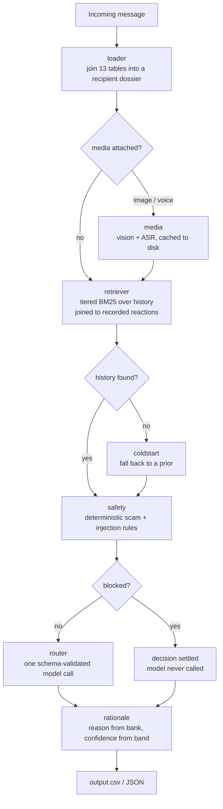

# Attention Router

Decides which messages interrupt you, which wait for later, and which are
suppressed — personalised per recipient, across text, image posters and voice
notes.

[](https://github.com/siddanth-6365/attention-router/actions/workflows/ci.yml)


---

## The problem, in one example

These two messages are **byte-identical**. Same text, same attached image,
same sender. They have opposite correct answers.

|  | Recipient A | Recipient B |
|---|---|---|
| Text | *"Photos for the kurta set are attached. Pickup is near Gate 2 this weekend."* | identical |
| Sender | `u_031` | `u_031` |
| What they did last time | opened it, read it two hours later | dismissed it, then **muted** the sender |
| Correct routing | `digest` | `mute` |

Nothing in the message separates them. The recipient's own recorded behaviour
does. So this is not a text classifier with some context bolted on — it is a
**retrieval system** that happens to end in a classification.

Everything else in the design follows from that.

---

## Quickstart

```bash
git clone https://github.com/siddanth-6365/attention-router
cd attention-router
python -m venv .venv && source .venv/bin/activate
pip install -e ".[synth,api,dev]"

cp .env.example .env          # add ANTHROPIC_API_KEY
python synth/generate.py      # build a synthetic corpus
attention-router route        # -> data/output.csv
```

No proprietary data is required. `synth/generate.py` builds the whole corpus —
13 relational CSVs plus rendered poster images and voice notes — so the project
is runnable the moment you clone it.

```bash
attention-router explain msg_001     # full decision trace for one message
attention-router evaluate            # score against the labelled split
pytest                               # 117 tests, no network, no API key
uvicorn attention_router.api:app     # HTTP service
```

---

## How it works



### Retrieval is tiered, and it is the whole game

Candidates come from the closest available relationship, then rank by BM25:

1. **same recipient + same sender** — directly comparable, and it covers ~85% of messages
2. same recipient + same group
3. same recipient, any conversation

Each hit is joined to its recorded reaction — opened, replied, dismissed, muted
afterwards, reported, and how fast — and collapsed into a single behavioural
verdict (`urgent_engagement`, `actively_rejected`, `previously_reported`, …).
**That verdict, not the message text, is what the prompt reasons over.**

Two implementation details that matter:

- Document frequencies for BM25 come from the entire history, not the candidate
  pool. Pools are frequently one or two documents, and pool-local IDF
  degenerates — a term appearing in every document scores zero.
- A second citation appears only when repetition is itself the argument. Two
  rows that agree on a negative reaction demonstrate a pattern; two that
  disagree just add noise.

No embeddings, deliberately. Pools are already filtered to one recipient and
one sender, so they are tiny. Lexical matching is both sufficient and more
precise on short chat text, and a vector store would be infrastructure without
a payoff.

### Safety is deterministic, and only blocks where it is certain

Rules with essentially perfect precision **block** — the decision is settled and
the model is never called. Everything else **flags**, passing a constraint into
the prompt for the model to weigh.

Blocking rules: brand impersonation, credential phishing, prompt injection.

The interesting part is the precision boundary. The corpus contains genuine
brand advisories reading *"we never ask for your OTP, card PIN, or payment
details."* A keyword matcher routes a warning **about** scams **as** a scam. So
the rules distinguish *requesting* a credential from *disclaiming* one — and a
phishing message that bolts a fake disclaimer on top is still caught.

Impersonation is a conjunction (`unverified` **and** domain mismatch) for the
same reason: the corpus deliberately contains verified, decades-old brands that
send through link shorteners. A single-signal rule flags them; a conjunction
does not.

### Reason and confidence are structured, not generated

`reason` is selected by id from an authored bank. Two messages suppressed for
the same underlying cause carry the same explanation, which is what makes a
digest of fifty muted messages readable rather than fifty paraphrases of "this
looked like spam". Free text remains available when nothing fits.

`confidence` is a position within a band owned by the action, set by evidence
strength. A number derived from how much support a decision has is checkable; a
number a model picks for itself mostly is not.

### The model cannot break the contract

`action` and `message_type` are validated against enums. Evidence ids are
rejected unless they appeared in the candidate list handed to the model, so it
cannot invent a citation. A rejection is fed back as a specific repair
instruction rather than a blind resample. If every attempt fails, a
deterministic fallback derived from the safety verdict and behavioural signal
produces the row — and **says so**, which is the subject of the next section.

---

## Results

Measured on the labelled split of a generated corpus, with the evaluation
harness calling the production entry point — the scored path and the shipped
path are the same code and cannot drift apart.

| Configuration | Action accuracy |
|---|---|
| Full pipeline | **80.0%** |
| Retrieval disabled | 62.5% |

The evaluator also reports per-class precision and recall across all eleven
message types, evidence precision/recall, reason similarity, confidence MAE and
band membership, plus a per-error dump:

```bash
attention-router evaluate --errors
attention-router evaluate --no-evidence      # ablations
attention-router evaluate --no-safety
attention-router evaluate --no-coldstart
```

### The cold-start experiment — a negative result

Retrieval is the core mechanism and it has an obvious failure mode: a
first-contact sender has no history to look up. I added priors to cover that
gap, then measured whether they helped.

**They did not. The first version made things measurably worse** — routing
accuracy fell by 12.5 points with priors enabled on fully-masked history.

The diagnosis came from the data rather than from the model. Borrowing a
sender's reputation from other recipients only works if senders behave
consistently across recipients, so I checked whether they do:

| Sender type | Provoke an identical reaction from every recipient |
|---|---|
| Personal senders | **22%** |
| Business senders | 45% |

Whether you want your neighbour's messages is a fact about your *relationship*,
not about your neighbour. Importing a stranger's engagement preference is
mostly noise — which is what the accuracy drop was measuring.

Abuse is the exception: a phishing script targets everyone, so a reported
sender stays reported regardless of who receives the next message. The prior is
now restricted to that transferable signal, plus category baselines drawn from
the recipient's *own* behaviour.

After the fix the regression is gone, but a clear benefit has not been
demonstrated either — at this sample size a single row moves accuracy by more
than the effect being measured. **The honest summary is: harmful, then
neutral.** It ships because the restriction is principled and costs nothing,
not because the numbers vindicate it.

The 22% consistency measurement, by contrast, needs no model at all and is the
most reusable finding here.

---

## Engineering notes

**Failed calls are reported, never hidden.** A row whose model call fails falls
back to a heuristic — which still satisfies the output contract. During
development a rate-limited run silently pushed a third of its rows onto that
fallback while printing `verified 110 rows` and exiting zero. A degraded run
that passes its own validation is worse than one that crashes. Every run now
prints a decision-source breakdown and exits non-zero above 5% degradation.

**Determinism, honestly.** Retrieval ordering, safety rules, reason selection,
confidence calibration, output row order and the media cache are all
deterministic; concurrency never changes the output file. The model call is not
bit-reproducible — current Claude models reject `temperature` outright, so it
cannot be pinned. `--votes N` majority-samples if you want to trade cost for
stability.

**Cost is visible.** Every run prints tokens and estimated spend, because the
cost of a change should be measured rather than assumed:

```
usage: 42 model calls | 172,455 in + 4,708 out tokens | ~$0.392 on claude-sonnet-5
```

**Provider-pluggable.** The router runs on Anthropic, or on Groq's hosted open
models via a stdlib HTTP client — no second SDK. Swap with one environment
variable and score both with the same harness:

```bash
ROUTER_PROVIDER=groq GROQ_ROUTER_MODEL=openai/gpt-oss-120b attention-router evaluate
```

**Media formats are sniffed, not trusted.** The generator emits JPEG, PNG and
WebP files all named `.jpg`, because that is what real media pipelines look
like. Format comes from magic bytes; unsupported encodings are rejected locally
rather than after three failed round trips.

---

## Layout

| Path | Role |
|---|---|
| `src/attention_router/loader.py` | 13 CSVs → indexes → per-message dossier |
| `src/attention_router/retriever.py` | tiered BM25 retrieval + behavioural signal |
| `src/attention_router/safety.py` | deterministic risk rules, injection fencing |
| `src/attention_router/coldstart.py` | priors for senders with no history |
| `src/attention_router/rationale.py` | reason bank + confidence calibration |
| `src/attention_router/llm.py` | provider clients, JSON extraction, backoff, usage |
| `src/attention_router/router.py` | prompt assembly, validation, fallback |
| `src/attention_router/explain.py` | end-to-end decision trace |
| `src/attention_router/api.py` | FastAPI service |
| `src/attention_router/evaluate.py` | scorer, confusion matrices, ablations |
| `synth/generate.py` | the synthetic corpus |
| `tests/` | 117 tests, offline, no API key |

---

## Origin

Built for the HackerRank Orchestrate hackathon (August 2026), then rebuilt as a
standalone project.

The challenge dataset is **not** redistributed here — it is HackerRank's
property and carries no licence permitting redistribution. Everything in this
repository is original code, and `synth/generate.py` exists so the project runs
without it. Reproducing the *phenomena* rather than the data turned out to be
the more interesting exercise anyway: planting an identical-text pair with
opposite correct answers, or an impersonation cluster that stays separable from
legitimate brands on link shorteners, requires understanding the domain in a
way that copying rows does not.

MIT licensed.
