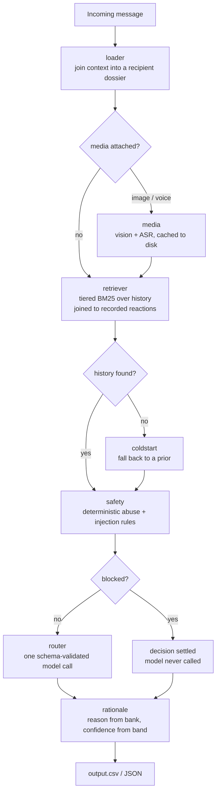

# Attention Router

**Notification triage that learns from what each person actually does.** For
every incoming message it decides: interrupt now, save for a digest, or
suppress — personalised per recipient, across text, images and voice notes.

[](https://github.com/siddanth-6365/attention-router/actions/workflows/ci.yml)


---

## The problem

Any high-volume messaging surface — a chat app, a support inbox, an alerting
system — eventually produces more notifications than anyone can read. The two
failure modes arrive together: important messages get buried, and unwanted
ones interrupt.

The obvious fix is to classify message content. It doesn't work, because
**the same content deserves different handling for different people.**

Here are two messages that are byte-identical — same text, same attached image,
same sender — with opposite correct answers:

|  | Recipient A | Recipient B |
|---|---|---|
| Text | *"Photos for the kurta set are attached. Pickup is near Gate 2 this weekend."* | identical |
| Sender | `u_031` | `u_031` |
| What they did last time | opened it, read it two hours later | dismissed it, then **muted** the sender |
| Correct routing | `digest` | `mute` |

Nothing in the message separates them. The recipient's own recorded behaviour
does.

So this is **not a classifier with context bolted on. It is a retrieval system
that happens to end in a classification** — and every design decision below
follows from that.

---

## The approach



The principle throughout: **deterministic code does everything it can do
reliably, and the model is asked only for the judgement it is uniquely good
at** — reading a message in context once the evidence is already assembled.

### 1. Retrieval is the core

For each message, pull the recipient's history with that same sender, ranked
by BM25 and tiered by how much the relationship tells us:

1. **same recipient + same sender** — directly comparable (~85% of messages)
2. same recipient + same group
3. same recipient, any conversation

Each hit is joined to its recorded reaction — opened, replied, dismissed,
muted afterwards, reported, and how fast — and collapsed into one behavioural
verdict (`urgent_engagement`, `actively_rejected`, `previously_reported`, …).
**That verdict, not the message text, is what the prompt reasons over.**

Two details that matter in practice:

- BM25 document frequencies come from the entire history, not the candidate
  pool. Pools are often one or two documents, where pool-local IDF degenerates
  — a term appearing in every document scores zero.
- A second citation appears only when repetition *is* the argument. Two rows
  agreeing on a negative reaction show a pattern; two that disagree add noise.

No embeddings, deliberately. Pools are already filtered to one recipient and
one sender, so they're tiny. Lexical matching is sufficient and more precise on
short messages; a vector store would be infrastructure without a payoff.

### 2. Safety is deterministic, and blocks only where it's certain

Rules with essentially perfect precision **block** — the decision is settled
and the model is never called. Everything else **flags**, passing a constraint
into the prompt to be weighed.

Blocking rules: brand impersonation, credential phishing, prompt injection.

The interesting part is the precision boundary. Legitimate organisations send
security advisories reading *"we never ask for your OTP, card PIN, or payment
details."* A keyword matcher routes a warning **about** fraud **as** fraud. So
the rules separate *requesting* a credential from *disclaiming* one — and a
phishing message that bolts on a fake disclaimer is still caught.

Impersonation is a conjunction (`unverified` **and** domain mismatch) for the
same reason: real brands do send through link shorteners, and a single-signal
rule flags them.

### 3. The model cannot break the contract

Actions and types are validated against enums. Evidence ids are rejected
unless they appeared in the candidate list handed to the model, so it cannot
invent a citation. A rejection is fed back as a specific repair instruction
rather than a blind resample. If every attempt fails, a deterministic fallback
produces the row — and **reports that it did**.

### 4. Explanations and confidence are structured

`reason` is selected by id from an authored bank, so two messages suppressed
for the same cause carry the same explanation. That's what makes a digest of
fifty muted messages readable instead of fifty paraphrases of "this looked like
spam". Free text remains available when nothing fits.

`confidence` is a position within a band owned by the action, set by evidence
strength. A number derived from how much support a decision has is checkable;
a number a model picks for itself mostly isn't.

---

## Quickstart

```bash
git clone https://github.com/siddanth-6365/attention-router
cd attention-router
python -m venv .venv && source .venv/bin/activate
pip install -e ".[synth,api,dev]"

cp .env.example .env          # add ANTHROPIC_API_KEY
python synth/generate.py      # build a synthetic corpus to play with
attention-router route        # -> data/output.csv
```

```bash
attention-router explain msg_001     # full decision trace for one message
attention-router evaluate            # score against labelled data
pytest                               # 121 tests, no network, no API key
uvicorn attention_router.api:app     # HTTP service
```

`explain` is the fastest way to understand the system — it prints the recipient
dossier, every retrieval candidate with its BM25 score, the behavioural
verdict, which safety rules fired, and how confidence was arrived at.

---

## Using it with your own data

The router reads a directory of CSVs. Point it anywhere:

```bash
export ATTENTION_ROUTER_DATA=/path/to/your/corpus
attention-router route
```

**Two tables are required**: `message_history.csv` (what was sent) and
`message_events.csv` (what the recipient did about it). Everything else —
users, groups, organisational senders, media — is read when present and
skipped when absent, so you can start with what you have.

```
message_history.csv   message_id, user_id, sender_user_id | business_id,
                      created_at, message_text, media_type, media_id, ...
message_events.csv    user_id, message_id, message_opened, message_replied,
                      reaction_time_minutes, notification_dismissed,
                      muted_after_message, message_reported
```

The taxonomy is yours to change: actions, message types and confidence bands
live in `config.py`, the model-facing definitions in
`prompts/router_system.md`, and the explanation bank in `reasons.json`.

**→ [docs/DATA_SCHEMA.md](docs/DATA_SCHEMA.md)** covers the full contract,
the conventions that bite (blank vs zero reaction times, boolean encoding),
how to adapt the taxonomy, and how to evaluate against your own labels.

If you have no data yet, `synth/generate.py` builds a complete corpus —
relational tables plus rendered poster images and voice notes — with the
interesting phenomena deliberately planted: identical-text pairs with opposite
outcomes, an impersonation cluster that stays separable from legitimate brands
on shorteners, security advisories that must *not* be flagged, and
first-contact senders with no history.

---

## Results

Two evaluations, because they answer different questions.

### On a public benchmark

The design was validated against the **HackerRank Orchestrate (August 2026)**
notification-routing dataset — 30 labelled messages spanning text, image
posters and voice notes, with hidden ground truth for a further 110.

| Metric | Result |
|---|---|
| Action accuracy (`notify`/`digest`/`mute`) | **100%** (30/30) |
| Message-type accuracy (11 classes) | **100%** (30/30) |
| Confidence MAE | 0.029 |
| Safety-rule false positives | 0 |
| Rows falling back to heuristics | 0 / 110 |

Ablations on that dataset, which is where the architecture justifies itself:

| Configuration | Action accuracy |
|---|---|
| Full pipeline | **100%** |
| Retrieval disabled | 90.0% |
| Media understanding disabled | 96.7% |
| Safety layer disabled | 100% (type accuracy 96.7%) |

Removing retrieval costs more than removing anything else — which is the whole
thesis, measured.

### On generated data

The synthetic corpus is harder and noisier by construction, and it's what CI
and the ablations run against:

| Configuration | Action accuracy |
|---|---|
| Full pipeline | 80.0% |
| Retrieval disabled | 62.5% |

Same direction, same magnitude of contribution from retrieval.

### A negative result worth reporting

Retrieval has an obvious weakness: a first-contact sender has no history. I
added priors to cover that gap, then measured whether they helped.

**They didn't — the first version made things worse**, dropping accuracy 12.5
points on fully-masked history.

The diagnosis came from the data. Borrowing a sender's reputation from other
recipients only works if senders behave consistently across recipients:

| Sender type | Provoke an identical reaction from every recipient |
|---|---|
| Personal senders | **22%** |
| Organisational senders | 45% |

Whether you want your neighbour's messages is a fact about your *relationship*,
not about your neighbour. Importing a stranger's engagement preference is
mostly noise — exactly what the accuracy drop measured.

Abuse is the exception: a phishing campaign targets everyone, so a reported
sender stays reported. The prior is now restricted to that transferable signal
plus category baselines drawn from the recipient's *own* behaviour. The
regression is gone; a clear benefit is not demonstrated. **Honest summary:
harmful, then neutral.** It ships because the restriction is principled and
costs nothing, not because the numbers vindicate it.

---

## Engineering notes

**Failed calls are reported, never hidden.** A row whose model call fails falls
back to a heuristic — which still satisfies the output contract. During
development a rate-limited run silently pushed a third of its rows onto that
fallback while printing `verified 110 rows` and exiting zero. A degraded run
that passes its own validation is worse than one that crashes. Every run now
prints a decision-source breakdown and exits non-zero above 5% degradation.

**Determinism, honestly.** Retrieval ordering, safety rules, reason selection,
confidence calibration, output row order and the media cache are deterministic;
concurrency never changes the output file. The model call is not
bit-reproducible — current Claude models reject `temperature`, so it cannot be
pinned. `--votes N` majority-samples to trade cost for stability.

**Cost is visible**, because the cost of a change should be measured:

```
usage: 42 model calls | 172,455 in + 4,708 out tokens | ~$0.392 on claude-sonnet-5
```

**Provider-pluggable.** Runs on Anthropic, or on Groq's hosted open models via
a stdlib HTTP client — no second SDK. Score both with the same harness:

```bash
ROUTER_PROVIDER=groq GROQ_ROUTER_MODEL=openai/gpt-oss-120b attention-router evaluate
```

Measured trade-off: Sonnet 5 scored 100%/100% on the benchmark at ~$1.00 per
110 messages; `gpt-oss-120b` scored 96.7%/90.0% at roughly a tenth of that.

**Media formats are sniffed, not trusted.** Real pipelines serve PNG and WebP
files named `.jpg`. Format comes from magic bytes; unsupported encodings are
rejected locally rather than after three failed round trips.

---

## Layout

| Path | Role |
|---|---|
| `src/attention_router/loader.py` | CSVs → indexes → per-message dossier |
| `src/attention_router/retriever.py` | tiered BM25 retrieval + behavioural signal |
| `src/attention_router/safety.py` | deterministic risk rules, injection fencing |
| `src/attention_router/coldstart.py` | priors for senders with no history |
| `src/attention_router/rationale.py` | explanation bank + confidence calibration |
| `src/attention_router/llm.py` | provider clients, JSON extraction, backoff, usage |
| `src/attention_router/router.py` | prompt assembly, validation, fallback |
| `src/attention_router/explain.py` | end-to-end decision trace |
| `src/attention_router/api.py` | FastAPI service |
| `src/attention_router/evaluate.py` | scorer, confusion matrices, ablations |
| `synth/generate.py` | synthetic corpus generator |
| `docs/DATA_SCHEMA.md` | bring-your-own-data contract |
| `tests/` | 121 tests, offline, no API key |

---

## Origin and credits

The problem statement comes from the **HackerRank Orchestrate hackathon
(August 2026)**, whose starter repository and dataset are publicly available at
[interviewstreet/hackerrank-orchestrate-august26](https://github.com/interviewstreet/hackerrank-orchestrate-august26).
The benchmark results above were measured on that dataset, and credit for the
problem framing and the evaluation data belongs to HackerRank.

This repository is a rebuild of my submission as a general-purpose tool. It
contains original code only — the challenge dataset is not redistributed here,
since it carries no licence permitting that. `synth/generate.py` exists so the
project is fully runnable without it, and reproducing the *phenomena* rather
than the rows turned out to be the more interesting exercise: planting an
identical-text pair with opposite correct answers, or an impersonation cluster
that stays separable from legitimate brands on link shorteners, requires
understanding the domain in a way that copying data does not.

MIT licensed.
